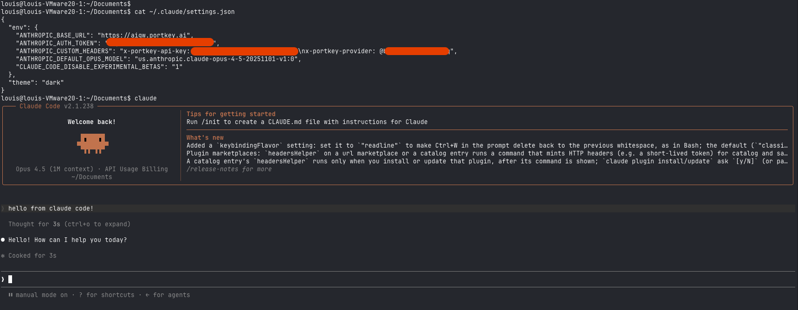
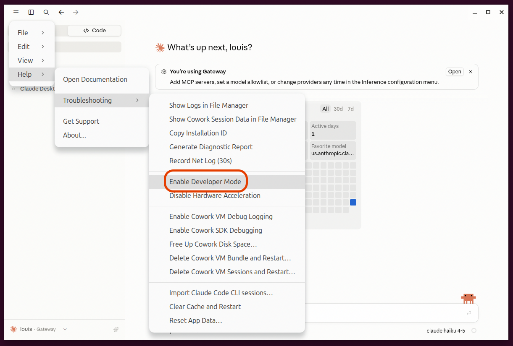
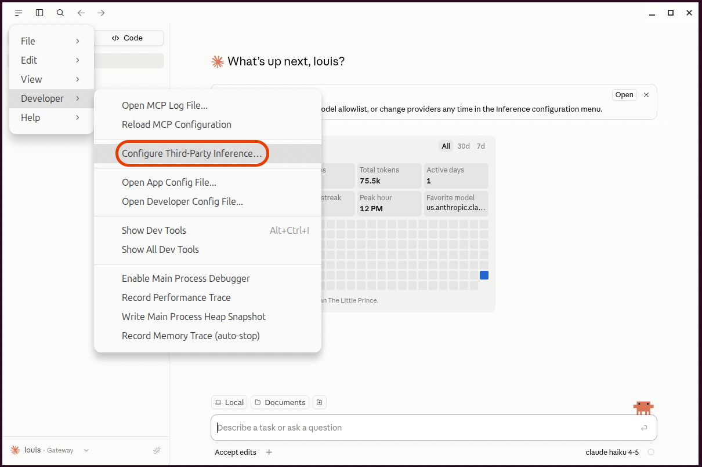
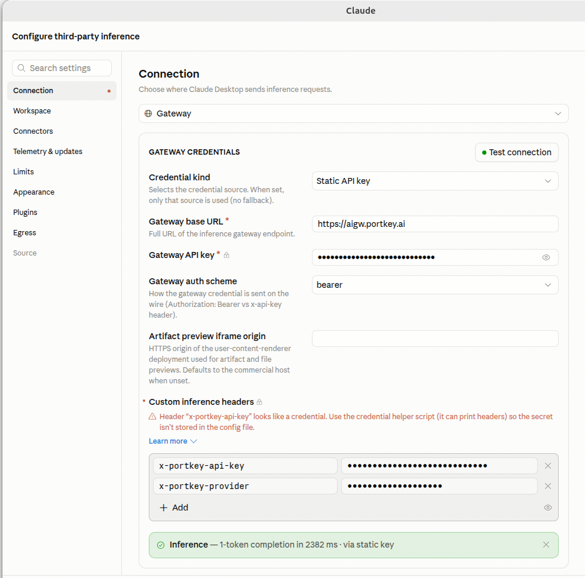
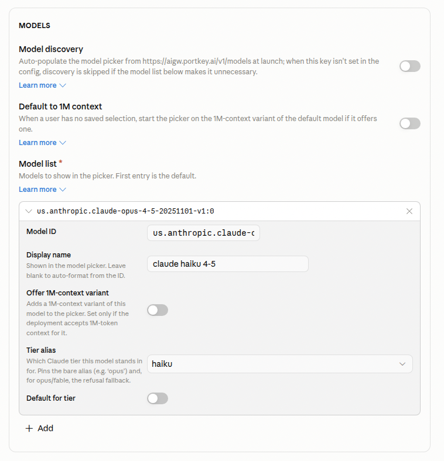
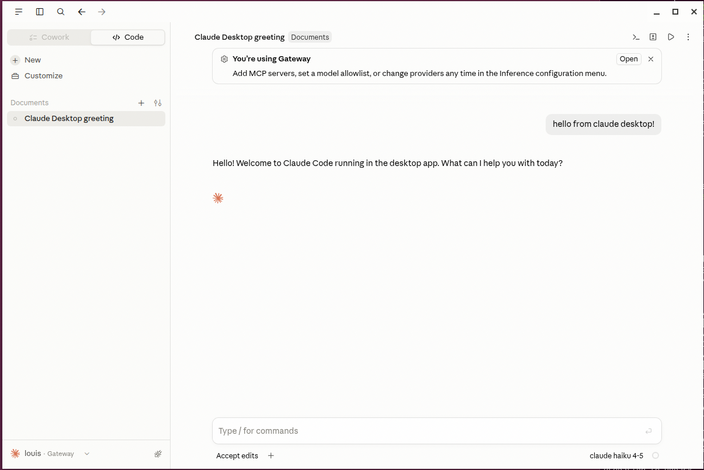

# Claude integration

How to point Claude clients at the AIGW. Replace the placeholders from the
[main README](../README.md#what-you-need-to-configure):

- `YOUR_API_KEY` — your AIGW / Portkey key
- `YOUR_PROVIDER_SLUG` — e.g. `@aws-claude-bedrock-v2`
- `YOUR_MODEL_ID` — e.g. `us.anthropic.claude-opus-4-5-20251101-v1:0`

---

## Claude Code

> ✅ **Confirmed working.**

Claude Code reads config from `~/.claude/settings.json`. Point it at the AIGW by
overriding the base URL and adding the AIGW headers.

1. Open (or create) `~/.claude/settings.json`.
2. Add the `env` keys below (merge into an existing file rather than overwriting).
3. Replace `YOUR_API_KEY`, `YOUR_PROVIDER_SLUG`, and `YOUR_MODEL_ID`.
4. Restart Claude Code.

```json
{
  "env": {
    "ANTHROPIC_BASE_URL": "https://aigw.portkey.ai",
    "ANTHROPIC_AUTH_TOKEN": "YOUR_API_KEY",
    "ANTHROPIC_CUSTOM_HEADERS": "x-portkey-api-key: YOUR_API_KEY\nx-portkey-provider: YOUR_PROVIDER_SLUG",
    "ANTHROPIC_DEFAULT_OPUS_MODEL": "YOUR_MODEL_ID",
    "CLAUDE_CODE_DISABLE_EXPERIMENTAL_BETAS": "1"
  },
  "theme": "dark"
}
```

### Proven example

The same config in use — `cat ~/.claude/settings.json` (secrets redacted), then
`claude` running a prompt successfully through the AIGW:



### What each field does

| Field | Purpose |
|-------|---------|
| `ANTHROPIC_BASE_URL` | The AIGW endpoint. **No `/v1`** — Claude Code appends `/v1/messages` itself. |
| `ANTHROPIC_AUTH_TOKEN` | Claude Code requires an auth token; set it to your AIGW key. |
| `ANTHROPIC_CUSTOM_HEADERS` | Newline-separated AIGW headers: `x-portkey-api-key` (auth) and `x-portkey-provider` (routing). |
| `ANTHROPIC_DEFAULT_OPUS_MODEL` | The model ID Claude Code uses for its Opus tier. (Also `_SONNET_MODEL` / `_HAIKU_MODEL` if you use those tiers.) |
| `CLAUDE_CODE_DISABLE_EXPERIMENTAL_BETAS` | `"1"` — disables experimental beta headers the gateway/provider may reject. |

### Troubleshooting

- **`API Error: 500 fetch failed` / 404** — base URL must be
  `https://aigw.portkey.ai` with **no** `/v1` suffix.
- **Auth errors** — check `YOUR_API_KEY` was replaced in both places.
- **Model errors** — the model ID must match the provider your slug routes to.

---

## Claude Desktop

> ✅ **Confirmed working.**

Claude Desktop routes through the AIGW using its built-in **third-party
inference** ("Gateway") configuration. You point it at the AIGW endpoint, send the
same `x-portkey-*` custom headers as Claude Code, turn **off** model discovery,
and add your model manually.

The same three placeholders apply: `YOUR_API_KEY`, `YOUR_PROVIDER_SLUG`,
`YOUR_MODEL_ID`.

### Step 1 — Enable Developer Mode

The third-party inference settings only appear once Developer Mode is on.

**Help → Troubleshooting → Enable Developer Mode**



### Step 2 — Open the third-party inference config

**Developer → Configure Third-Party Inference…**



### Step 3 — Configure the connection

On the **Connection** tab:

| Setting | Value |
|---------|-------|
| Connection | **Gateway** |
| Credential kind | **Static API key** |
| Gateway base URL | `https://aigw.portkey.ai` |
| Gateway API key | `YOUR_API_KEY` |
| Gateway auth scheme | **bearer** |
| Artifact preview iframe origin | _(leave blank)_ |

Then add the **Custom inference headers** — these are the same AIGW headers Claude
Code sends:

| Header | Value |
|--------|-------|
| `x-portkey-api-key` | `YOUR_API_KEY` |
| `x-portkey-provider` | `YOUR_PROVIDER_SLUG` |

Click **Test connection** — a successful call shows a green
"Inference — 1-token completion … via static key" confirmation.



> ⚠️ Claude Desktop flags `x-portkey-api-key` as looking like a credential and
> suggests using a credential helper script so the secret isn't stored in the
> config file. For a hardened setup, follow that guidance instead of pasting the
> key inline.

### Step 4 — Turn off model discovery and add your model

In the **Models** section of the same config screen:

- **Model discovery** → **OFF**. (When on, it auto-populates the model picker
  from `https://aigw.portkey.ai/v1/models` at launch. With it off you specify the
  model yourself, which is what we want.)
- Under **Model list**, click **Add** and fill in:

| Field | Value |
|-------|-------|
| Model ID | `YOUR_MODEL_ID` (e.g. `us.anthropic.claude-opus-4-5-20251101-v1:0`) |
| Display name | Any label to show in the picker (e.g. `claude opus 4-5`) |
| Offer 1M-context variant | Off (unless your deployment accepts 1M-token context) |
| Tier alias | Which Claude tier this model stands in for (`opus` / `sonnet` / `haiku`) |
| Default for tier | On, if this should be the default model for that tier |

The first entry in the model list is the default.



### Result

Claude Desktop shows a **"You're using Gateway"** banner and the account row reads
**Gateway**. Prompts now route through the AIGW.


