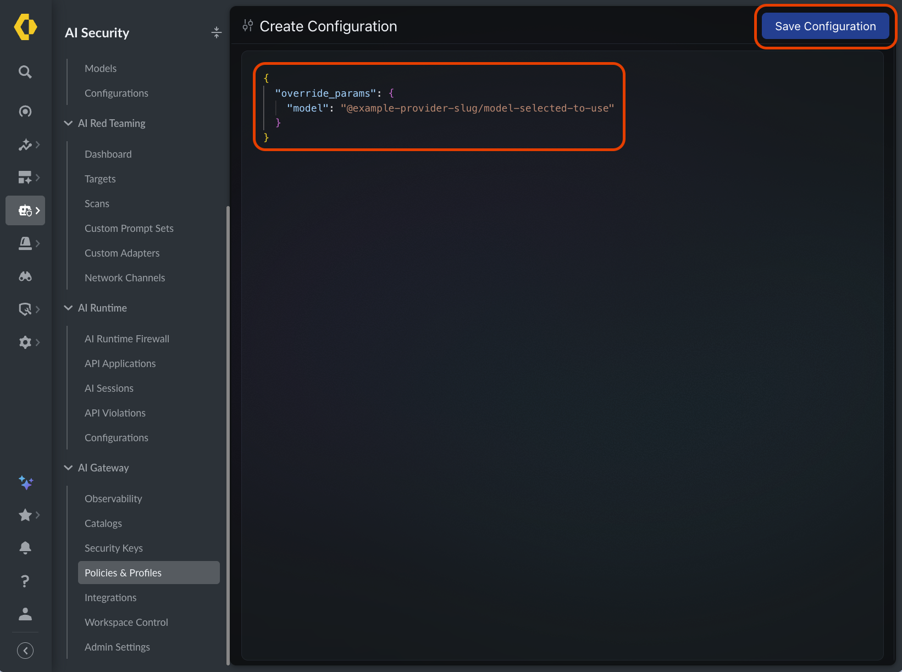
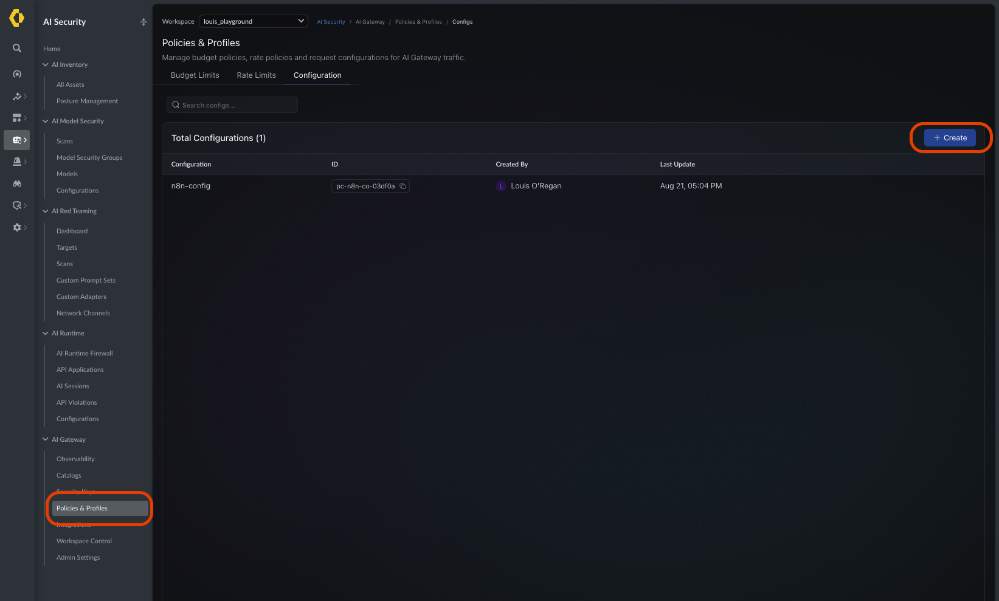
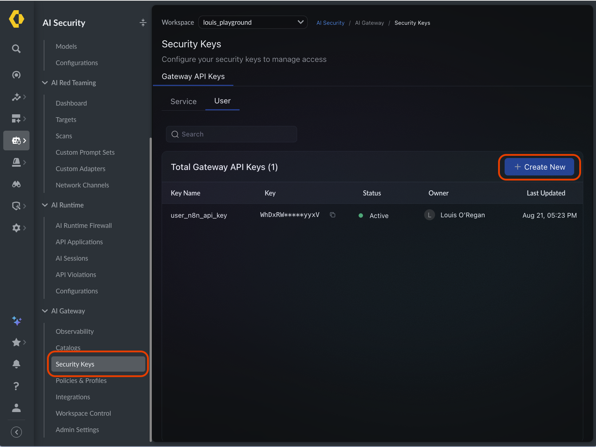
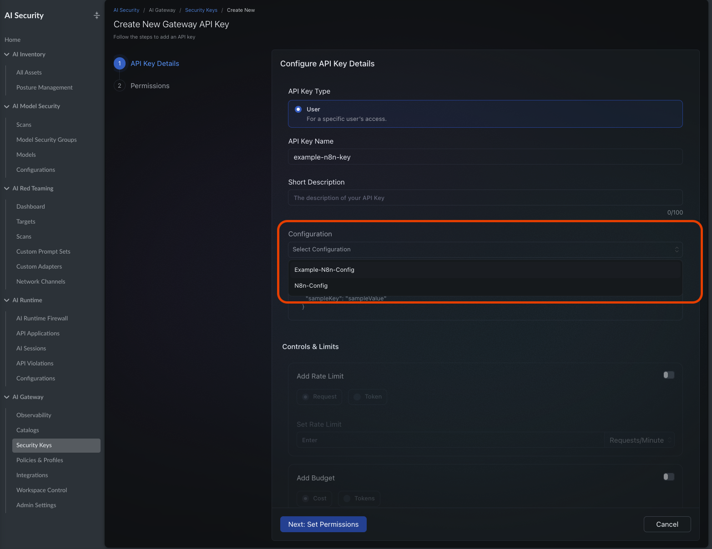
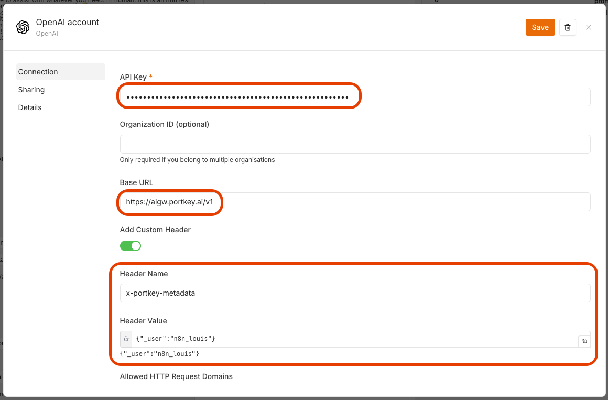
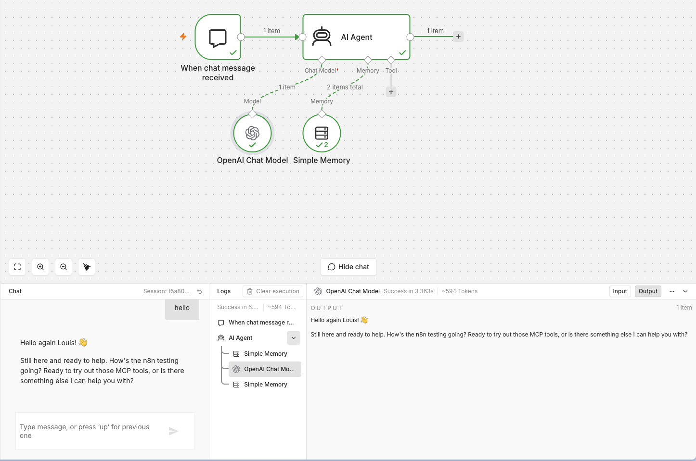

# n8n integration

> ✅ **Confirmed working** — n8n (in Docker) → AIGW → AWS Bedrock, verified
> end-to-end with a live model response.

## How this pattern differs from the Claude clients

The [Claude integration](claude.md) sends the provider on **every request** via
the `x-portkey-provider` header. n8n uses a cleaner pattern:

**Routing is baked into a Gateway Config that is attached to the API key.** The
config injects the provider + model automatically, so n8n's stock **OpenAI node**
works with just a **Base URL + API key** — no provider or routing headers on the
client.

```
n8n OpenAI node  ──(base URL + API key)──►  AIGW  ──(config on key adds provider+model)──►  provider
```

> **The provider doesn't matter.** This walkthrough uses AWS Bedrock, but the flow
> is identical for **any provider provisioned in the AIGW** (Anthropic, Vertex,
> Azure OpenAI, ...). Only two things change: the provider slug in the config's
> `override_params.model` and the model ID. Everything on the n8n side stays the
> same.

Placeholders used below:

- `YOUR_GATEWAY_API_KEY` — the gateway API key you create in Step 2
- `YOUR_PROVIDER_SLUG` — the slug of any provider provisioned in the AIGW,
  e.g. `@example-bedrock`
- `YOUR_MODEL_ID` — a model ID valid for that provider,
  e.g. `us.anthropic.claude-opus-4-5-20251101-v1:0`

## Prerequisites

- Access to the **Strata Cloud Manager → AI Security** console, in your workspace
  (e.g. `your-workspace`), under **AI Gateway**.
- A **provider/integration already configured in the gateway** with a known slug
  (`YOUR_PROVIDER_SLUG`) and at least one model ID you can call. This example uses
  an Amazon Bedrock provider (region `us-east-1`, Bedrock API key auth), but any
  provisioned provider works.
- The model must be **accessible from that provider**. For Bedrock specifically,
  the model's marketplace agreement must be accepted in the owning AWS account or
  the gateway returns `403 … aws-marketplace:Subscribe`.

---

## Step 1 — Create a Gateway Config

**AI Security → AI Gateway → Policies & Profiles → Configuration → Create.**

Enter a config body that pins the provider + model via `override_params`:

```json
{
  "override_params": {
    "model": "@<provider-slug>/<model-id>"
  }
}
```

Example value:

```json
{
  "override_params": {
    "model": "@example-bedrock/us.anthropic.claude-opus-4-5-20251101-v1:0"
  }
}
```



Click **Save Configuration**. The config appears in the list with a generated
**Config ID** (e.g. `pc-xxxxxxxx`, name `n8n-config`) — you'll select it by
name in the next step.



> **Why:** this makes the gateway inject the provider and model automatically, so
> the client never has to send `x-portkey-provider`.

---

## Step 2 — Create a Gateway API Key with that Config attached

**AI Security → AI Gateway → Security Keys → Gateway API Keys → User tab →
+ Create New.**



Fill in the key details:

| Field | Value |
|-------|-------|
| API Key Type | **User** |
| API Key Name | e.g. `user_n8n_api_key` |
| Short Description | _(optional)_ |
| **Configuration** | **Select the config from Step 1** (e.g. `n8n-config`) ← the critical link |
| Controls & Limits | _(optional)_ Rate Limit / Budget toggles |



Click **Next: Set Permissions**, finish, then **copy the key value** — it's shown
once (this is `YOUR_GATEWAY_API_KEY`). The key then shows as **Active** in the
list.

---

## Step 3 — Configure the n8n OpenAI credential

Add an **OpenAI** node (or **OpenAI Chat Model**) and edit its OpenAI account
credential:

| Field | Value |
|-------|-------|
| API Key | `YOUR_GATEWAY_API_KEY` (from Step 2) |
| Base URL | `https://aigw.portkey.ai/v1` ← must be this host, **not** `api.portkey.ai` |
| Organization ID | _(leave blank)_ |
| Add Custom Header | _(optional — for observability/attribution)_ |
| → Header Name | `x-portkey-metadata` |
| → Header Value | `{"_user":"n8n"}` |



No provider/config header is needed in n8n — routing comes from the config
attached to the key. The optional `x-portkey-metadata` header tags requests so you
can filter them in the gateway logs (see the
[metadata section in the README](../README.md#custom-metadata-log-filtering--attribution)).

Save the credential.

---

## Step 4 — Use it in a workflow

Wire up: **When chat message received → AI Agent**, with the **OpenAI Chat Model**
as the agent's Chat Model and **Simple Memory** attached. Send a test chat — a
successful model response confirms the full path (n8n → AIGW → provider).



### Import the example workflow

A ready-made version of this workflow is included:
[`n8n-workflow.example.json`](n8n-workflow.example.json). In n8n, use
**Import from File** and select it. It contains no secrets — on import, open the
**OpenAI Chat Model** node and point its credential at the OpenAI account you
configured in Step 3.

---

## Troubleshooting

- **`403 … aws-marketplace:Subscribe`** — the Bedrock model agreement isn't
  accepted in the AWS account; enable model access first.
- **Wrong host errors** — the Base URL must be `https://aigw.portkey.ai/v1`, not
  `api.portkey.ai`.
- **Model/provider errors** — check the `override_params.model` value in the
  config is `@<provider-slug>/<model-id>` and that the config is actually attached
  to the key you're using in n8n.
